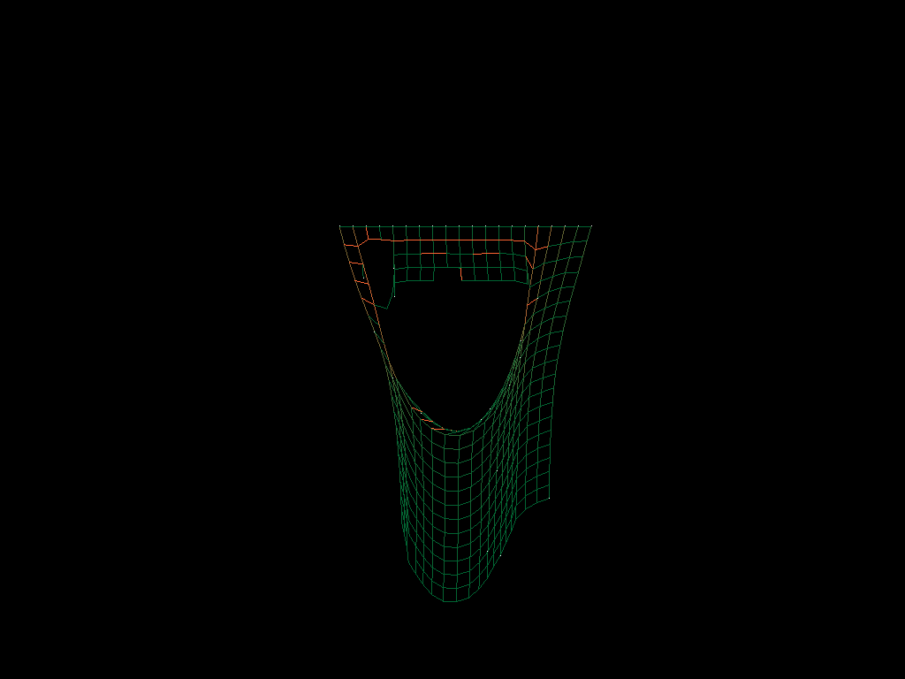

# Cloth Simulation
original: https://github.com/FelipesCoding/cloth_simulation

# Requirements

- CMake
- SFML-2.6.2 (build shared lib using MSVC pls or the same tool-chain for this project)

# Runtime Snapshot

